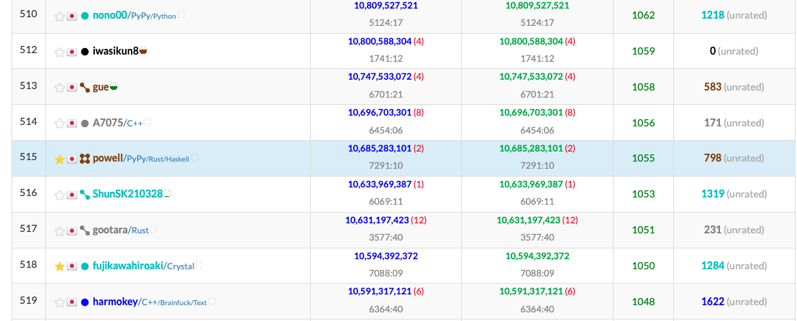

# sub3

## やりたいこと
- 直線距離での掘削を止める
- ランダムに周辺を掘り、コストが低そうな場所を優先的に通るようにする

## 実装
1. 家を選択
2. 家から最も近い水源を選ぶ
3. 家と水源の間の長方形領域からランダムに点をサンプリングし、試し掘りする
4. 最も値が小さい区間を掘り進める

## アイデア
- ダメージを与えた回数で、次に与えるダメージを重み付けする
- 試し掘りする長方形領域の大きさに応じてサンプル数を変える
- ルートを分割統治法に基づいて選択

## スコア

