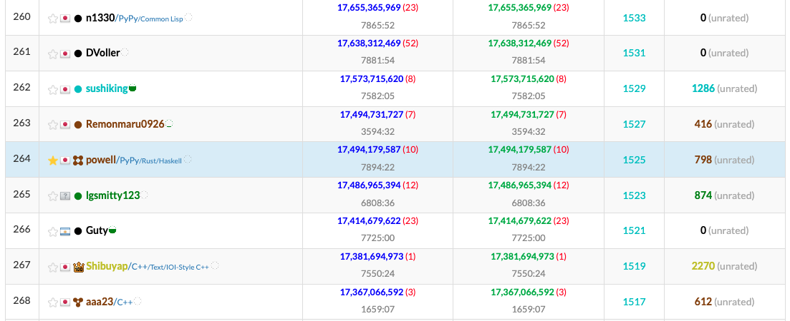

# sub12

## やりたいこと
- `sub09`を効率化
- 掘削する回数を元に、次に与える打撃を最適化する

## 実装
### 現状の関数（定数関数）
一回あたりのコストを加味する

$$
P = \max
\left\{
\begin{array}{l}
  50\\
  2C
\end{array}
\right.
$$

### 1次関数
等差数列を元に構成

$$
\begin{align}
    P_0 &= A\\
    P_{n+1} &= P_n + \Delta
\end{align}
$$

### 2次関数
階差数列の逆

$$
\begin{align}
    P_0 &= A\\
    P_{n+1} &= P_n + \Delta (T - n)
\end{align}
$$

### sub12_2D
- 2次関数版。スコアはかなり落ちる

## アイデア
- 周辺にある未到達の家によって中継地を重み付けする

## スコア

